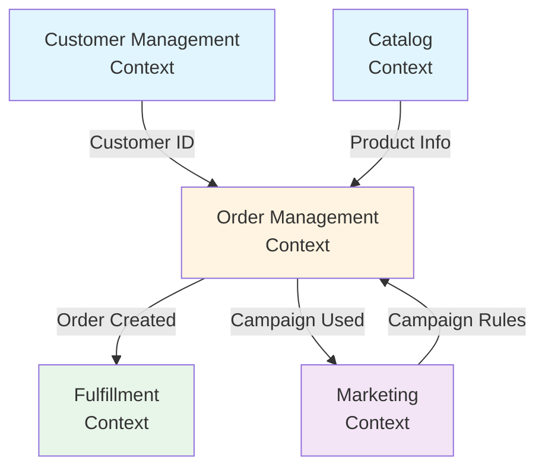
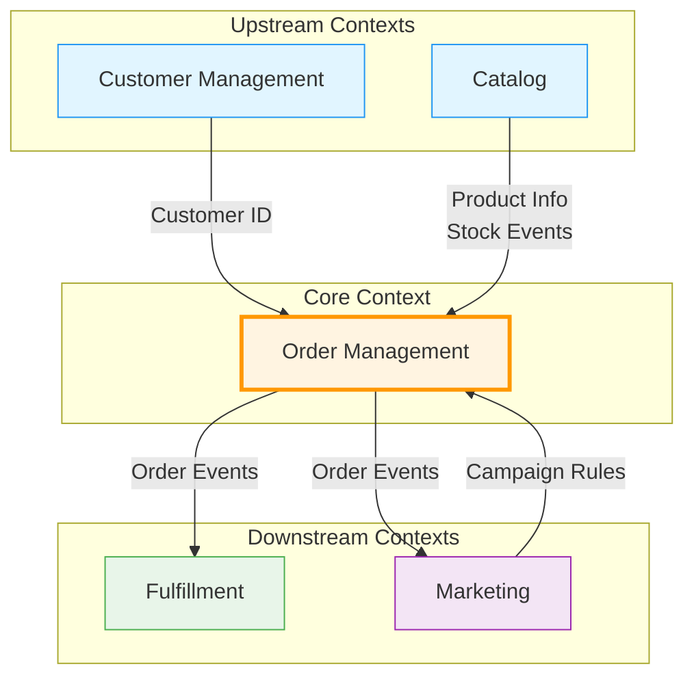
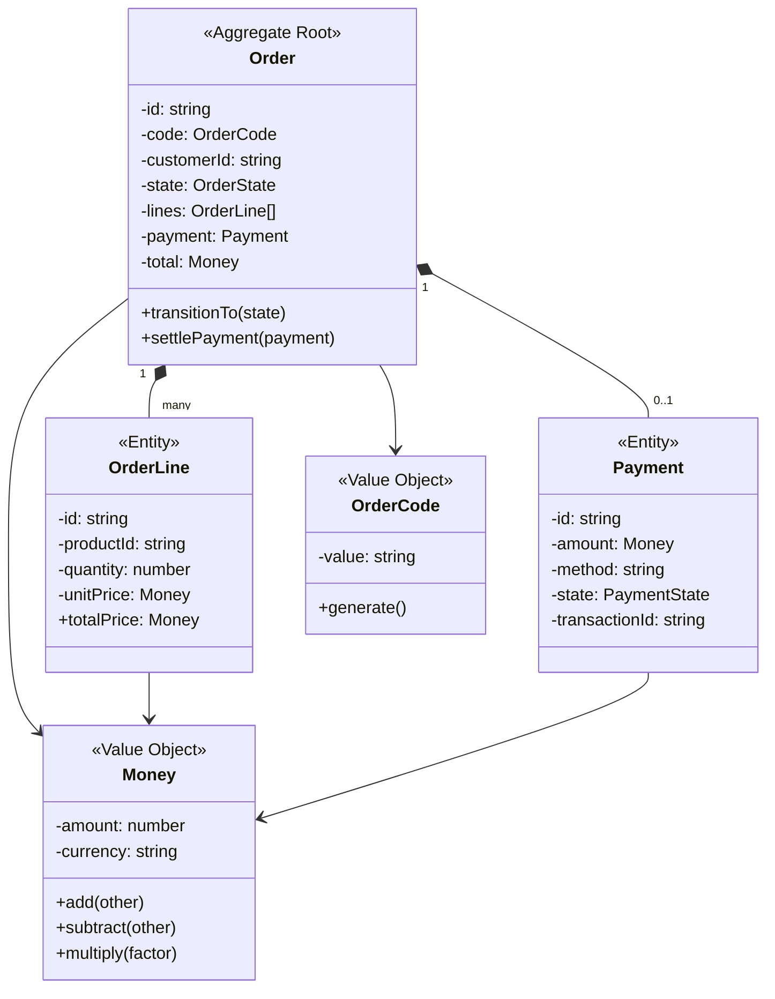
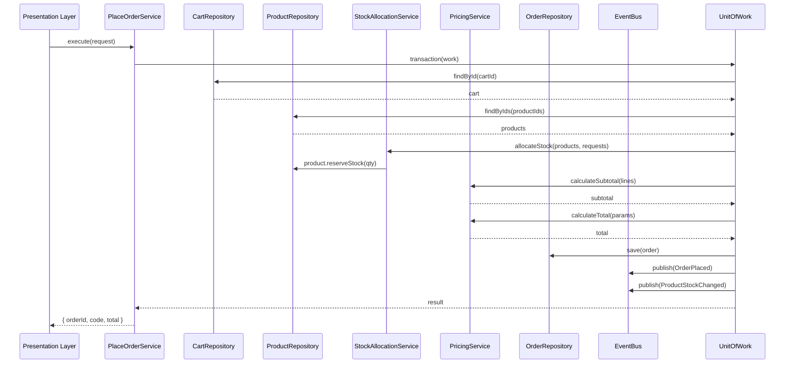
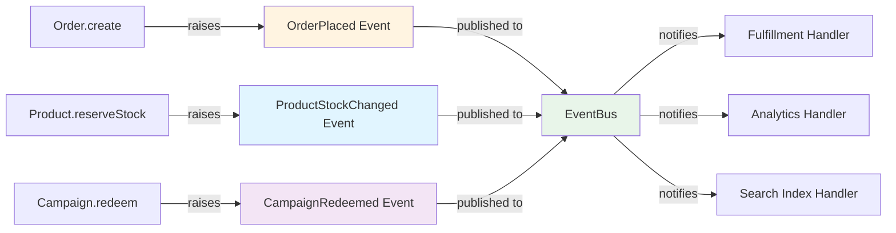

# Design Document: Backend DDD Refactoring

## Overview

This design document specifies the technical architecture for refactoring the Workit e-commerce backend from a Transaction Script / Anemic Domain Model to a Domain-Driven Design (DDD) architecture. The refactoring will introduce rich domain models, bounded contexts, domain events, and a layered architecture while maintaining backward compatibility with existing API contracts.

### Current State

The existing backend is a Fastify-based Node.js application with:
- Business logic embedded directly in HTTP endpoint handlers
- Anemic domain models (data structures without behavior)
- Direct database access via Drizzle ORM in route handlers
- Module organization by technical concerns (cart, checkout, catalog, etc.)
- Transaction Script pattern where each endpoint contains procedural logic

### Target State

The refactored architecture will feature:
- **Rich Domain Models**: Entities and value objects with encapsulated business logic
- **Bounded Contexts**: Clear boundaries around related domain concepts
- **Layered Architecture**: Separation of domain, application, infrastructure, and presentation concerns
- **Domain Events**: Decoupled communication between bounded contexts
- **Repository Pattern**: Abstract data access behind domain interfaces
- **Dependency Injection**: Testable, loosely coupled components

### Design Principles

1. **Domain-Centric**: Business logic lives in domain objects, not service methods
2. **Explicit Boundaries**: Bounded contexts define clear ownership and consistency boundaries
3. **Invariant Protection**: Aggregates enforce business rules at all times
4. **Testability**: Domain logic testable without infrastructure dependencies
5. **Incremental Migration**: Phased approach allowing old and new code to coexist
6. **Backward Compatibility**: Existing API contracts remain unchanged


## Architecture

### Layered Architecture

The system will follow a strict layered architecture with dependency rules enforced through TypeScript module boundaries:

```
┌─────────────────────────────────────────┐
│      Presentation Layer (API)          │
│  - Fastify routes                       │
│  - Request/Response DTOs                │
│  - Authentication/Authorization         │
└──────────────┬──────────────────────────┘
               │ depends on
               ▼
┌─────────────────────────────────────────┐
│      Application Layer                  │
│  - Application Services                 │
│  - Use Case Orchestration               │
│  - Transaction Management               │
│  - Event Publishing                     │
└──────────────┬──────────────────────────┘
               │ depends on
               ▼
┌─────────────────────────────────────────┐
│      Domain Layer (Core)                │
│  - Entities & Aggregates                │
│  - Value Objects                        │
│  - Domain Services                      │
│  - Domain Events                        │
│  - Repository Interfaces                │
└─────────────────────────────────────────┘
               ▲
               │ implements
               │
┌──────────────┴──────────────────────────┐
│      Infrastructure Layer               │
│  - Repository Implementations           │
│  - Drizzle ORM Integration              │
│  - External Service Adapters            │
│  - Event Bus Implementation             │
└─────────────────────────────────────────┘
```

**Dependency Rules:**
- **Domain Layer**: No dependencies on other layers (pure business logic)
- **Application Layer**: Depends only on Domain Layer
- **Infrastructure Layer**: Depends on Domain and Application layers (implements interfaces)
- **Presentation Layer**: Depends on Application Layer (not Domain or Infrastructure)

### Bounded Contexts

The system is organized into five bounded contexts, each with its own domain model and clear responsibilities:

#### 1. Catalog Context
**Responsibility**: Product catalog management, inventory, and search

**Core Concepts**:
- Product (Aggregate Root)
- Brand (Entity)
- Collection (Entity)
- Asset (Entity)
- ProductSKU (Value Object)
- Stock management

**Integration Points**:
- Publishes: `ProductStockChanged`, `ProductCreated`, `ProductUpdated`
- Subscribes to: None (upstream context)

#### 2. Order Management Context
**Responsibility**: Cart, checkout, order processing, and payment verification

**Core Concepts**:
- Order (Aggregate Root)
- Cart (Aggregate Root)
- OrderLine (Entity)
- CartLine (Entity)
- Payment (Entity)
- Money (Value Object)
- OrderCode (Value Object)

**Integration Points**:
- Publishes: `OrderPlaced`, `PaymentSettled`, `OrderStateChanged`
- Subscribes to: `ProductStockChanged`, `CampaignRedeemed`

#### 3. Customer Management Context
**Responsibility**: Customer identity, profiles, and address management

**Core Concepts**:
- Customer (Aggregate Root)
- Address (Value Object)
- Email (Value Object)
- PhoneNumber (Value Object)

**Integration Points**:
- Publishes: `CustomerRegistered`, `CustomerUpdated`
- Subscribes to: None (upstream context)

#### 4. Fulfillment Context
**Responsibility**: Shipping methods, order fulfillment, and delivery

**Core Concepts**:
- ShippingMethod (Entity)
- Fulfillment (Aggregate Root)
- DeliveryAddress (Value Object)

**Integration Points**:
- Publishes: `OrderFulfilled`, `OrderShipped`
- Subscribes to: `PaymentSettled`

#### 5. Marketing Context
**Responsibility**: Campaigns, discounts, banners, and promotional content

**Core Concepts**:
- Campaign (Aggregate Root)
- CampaignRedemption (Entity)
- Banner (Entity)
- BlogPost (Entity)

**Integration Points**:
- Publishes: `CampaignRedeemed`
- Subscribes to: `OrderPlaced`

### Context Map



**Relationship Types**:
- **Customer → Order**: Conformist (Order uses Customer ID as-is)
- **Catalog → Order**: Customer/Supplier (Order depends on Product data)
- **Marketing → Order**: Partnership (Shared campaign validation logic)
- **Order → Fulfillment**: Customer/Supplier (Fulfillment triggered by Order events)

### Directory Structure

```
backend/src/
├── domain/                          # Domain Layer
│   ├── catalog/
│   │   ├── entities/
│   │   │   ├── Product.ts
│   │   │   ├── Brand.ts
│   │   │   └── Collection.ts
│   │   ├── value-objects/
│   │   │   └── ProductSKU.ts
│   │   ├── services/
│   │   │   └── StockAllocationService.ts
│   │   ├── events/
│   │   │   └── ProductStockChanged.ts
│   │   ├── repositories/
│   │   │   └── IProductRepository.ts
│   │   └── errors/
│   │       └── InsufficientStockError.ts
│   ├── order-management/
│   │   ├── aggregates/
│   │   │   ├── Order.ts
│   │   │   └── Cart.ts
│   │   ├── entities/
│   │   │   ├── OrderLine.ts
│   │   │   ├── CartLine.ts
│   │   │   └── Payment.ts
│   │   ├── value-objects/
│   │   │   ├── Money.ts
│   │   │   └── OrderCode.ts
│   │   ├── services/
│   │   │   ├── PricingService.ts
│   │   │   ├── OrderStateService.ts
│   │   │   └── PaymentVerificationService.ts
│   │   ├── events/
│   │   │   ├── OrderPlaced.ts
│   │   │   └── PaymentSettled.ts
│   │   ├── repositories/
│   │   │   ├── IOrderRepository.ts
│   │   │   └── ICartRepository.ts
│   │   └── errors/
│   │       └── InvalidStateTransitionError.ts
│   ├── customer-management/
│   │   ├── aggregates/
│   │   │   └── Customer.ts
│   │   ├── value-objects/
│   │   │   ├── Address.ts
│   │   │   ├── Email.ts
│   │   │   └── PhoneNumber.ts
│   │   ├── events/
│   │   │   └── CustomerRegistered.ts
│   │   ├── repositories/
│   │   │   └── ICustomerRepository.ts
│   │   └── errors/
│   │       └── ValidationError.ts
│   ├── fulfillment/
│   │   ├── entities/
│   │   │   └── ShippingMethod.ts
│   │   ├── repositories/
│   │   │   └── IShippingMethodRepository.ts
│   │   └── events/
│   │       └── OrderFulfilled.ts
│   ├── marketing/
│   │   ├── aggregates/
│   │   │   └── Campaign.ts
│   │   ├── entities/
│   │   │   ├── CampaignRedemption.ts
│   │   │   └── Banner.ts
│   │   ├── repositories/
│   │   │   └── ICampaignRepository.ts
│   │   └── events/
│   │       └── CampaignRedeemed.ts
│   └── shared/
│       ├── Entity.ts                # Base entity class
│       ├── ValueObject.ts           # Base value object class
│       ├── AggregateRoot.ts         # Base aggregate root class
│       └── DomainEvent.ts           # Base domain event class
│
├── application/                     # Application Layer
│   ├── catalog/
│   │   └── services/
│   │       └── SearchProductsService.ts
│   ├── order-management/
│   │   └── services/
│   │       ├── PlaceOrderService.ts
│   │       ├── VerifyPaymentService.ts
│   │       └── AddToCartService.ts
│   ├── customer-management/
│   │   └── services/
│   │       └── RegisterCustomerService.ts
│   └── shared/
│       ├── IEventBus.ts
│       └── IUnitOfWork.ts
│
├── infrastructure/                  # Infrastructure Layer
│   ├── persistence/
│   │   ├── repositories/
│   │   │   ├── ProductRepository.ts
│   │   │   ├── OrderRepository.ts
│   │   │   ├── CartRepository.ts
│   │   │   ├── CustomerRepository.ts
│   │   │   └── CampaignRepository.ts
│   │   ├── mappers/
│   │   │   ├── ProductMapper.ts
│   │   │   ├── OrderMapper.ts
│   │   │   └── CustomerMapper.ts
│   │   └── unit-of-work/
│   │       └── DrizzleUnitOfWork.ts
│   ├── events/
│   │   ├── EventBus.ts
│   │   └── EventHandlers.ts
│   └── di/
│       └── container.ts             # Dependency injection setup
│
├── presentation/                    # Presentation Layer (existing modules/)
│   └── modules/
│       ├── cart/
│       ├── checkout/
│       ├── catalog/
│       └── ...
│
└── lib/                            # Existing shared utilities
    ├── db.ts
    ├── storage.ts
    └── ...
```


## Components and Interfaces

### Domain Layer Components

#### Base Classes

**Entity Base Class**
```typescript
// domain/shared/Entity.ts
export abstract class Entity<T> {
  protected readonly _id: T;
  
  constructor(id: T) {
    this._id = id;
  }
  
  get id(): T {
    return this._id;
  }
  
  equals(other: Entity<T>): boolean {
    if (other === null || other === undefined) {
      return false;
    }
    if (this === other) {
      return true;
    }
    return this._id === other._id;
  }
}
```

**Value Object Base Class**
```typescript
// domain/shared/ValueObject.ts
export abstract class ValueObject<T> {
  protected readonly props: T;
  
  constructor(props: T) {
    this.props = Object.freeze(props);
  }
  
  equals(other: ValueObject<T>): boolean {
    if (other === null || other === undefined) {
      return false;
    }
    return JSON.stringify(this.props) === JSON.stringify(other.props);
  }
}
```

**Aggregate Root Base Class**
```typescript
// domain/shared/AggregateRoot.ts
import { Entity } from './Entity.js';
import { DomainEvent } from './DomainEvent.js';

export abstract class AggregateRoot<T> extends Entity<T> {
  private _domainEvents: DomainEvent[] = [];
  
  get domainEvents(): ReadonlyArray<DomainEvent> {
    return this._domainEvents;
  }
  
  protected addDomainEvent(event: DomainEvent): void {
    this._domainEvents.push(event);
  }
  
  clearEvents(): void {
    this._domainEvents = [];
  }
}
```

**Domain Event Base Class**
```typescript
// domain/shared/DomainEvent.ts
export abstract class DomainEvent {
  public readonly occurredAt: Date;
  public readonly eventType: string;
  
  constructor(eventType: string) {
    this.occurredAt = new Date();
    this.eventType = eventType;
  }
}
```

#### Order Management Context - Core Components

**Money Value Object**
```typescript
// domain/order-management/value-objects/Money.ts
import { ValueObject } from '../../shared/ValueObject.js';

interface MoneyProps {
  amount: number;
  currency: string;
}

export class Money extends ValueObject<MoneyProps> {
  private constructor(props: MoneyProps) {
    super(props);
  }
  
  static create(amount: number, currency: string = 'KES'): Money {
    if (amount < 0) {
      throw new Error('Money amount cannot be negative');
    }
    return new Money({ amount, currency });
  }
  
  get amount(): number {
    return this.props.amount;
  }
  
  get currency(): string {
    return this.props.currency;
  }
  
  add(other: Money): Money {
    this.assertSameCurrency(other);
    return Money.create(this.amount + other.amount, this.currency);
  }
  
  subtract(other: Money): Money {
    this.assertSameCurrency(other);
    return Money.create(this.amount - other.amount, this.currency);
  }
  
  multiply(factor: number): Money {
    return Money.create(this.amount * factor, this.currency);
  }
  
  private assertSameCurrency(other: Money): void {
    if (this.currency !== other.currency) {
      throw new Error(`Currency mismatch: ${this.currency} vs ${other.currency}`);
    }
  }
}
```

**Order Aggregate**
```typescript
// domain/order-management/aggregates/Order.ts
import { AggregateRoot } from '../../shared/AggregateRoot.js';
import { OrderLine } from '../entities/OrderLine.js';
import { Payment } from '../entities/Payment.js';
import { Money } from '../value-objects/Money.js';
import { OrderCode } from '../value-objects/OrderCode.js';
import { OrderPlaced } from '../events/OrderPlaced.js';
import { OrderStateChanged } from '../events/OrderStateChanged.js';
import { InvalidStateTransitionError } from '../errors/InvalidStateTransitionError.js';

export enum OrderState {
  CREATED = 'CREATED',
  PAYMENT_SETTLED = 'PAYMENT_SETTLED',
  FULFILLED = 'FULFILLED',
  CANCELLED = 'CANCELLED'
}

interface OrderProps {
  code: OrderCode;
  customerId: string;
  state: OrderState;
  lines: OrderLine[];
  subTotal: Money;
  shipping: Money;
  tax: Money;
  discount: Money;
  total: Money;
  shippingAddressId: string;
  billingAddressId: string;
  shippingMethodId?: string;
  payment?: Payment;
  createdAt: Date;
  updatedAt: Date;
}

export class Order extends AggregateRoot<string> {
  private props: OrderProps;
  
  private constructor(id: string, props: OrderProps) {
    super(id);
    this.props = props;
  }
  
  static create(params: {
    id: string;
    code: OrderCode;
    customerId: string;
    lines: OrderLine[];
    subTotal: Money;
    shipping: Money;
    tax: Money;
    discount: Money;
    total: Money;
    shippingAddressId: string;
    billingAddressId: string;
    shippingMethodId?: string;
  }): Order {
    const order = new Order(params.id, {
      code: params.code,
      customerId: params.customerId,
      state: OrderState.CREATED,
      lines: params.lines,
      subTotal: params.subTotal,
      shipping: params.shipping,
      tax: params.tax,
      discount: params.discount,
      total: params.total,
      shippingAddressId: params.shippingAddressId,
      billingAddressId: params.billingAddressId,
      shippingMethodId: params.shippingMethodId,
      createdAt: new Date(),
      updatedAt: new Date()
    });
    
    order.addDomainEvent(new OrderPlaced(order.id, params.customerId, params.total.amount));
    return order;
  }
  
  get code(): OrderCode {
    return this.props.code;
  }
  
  get customerId(): string {
    return this.props.customerId;
  }
  
  get state(): OrderState {
    return this.props.state;
  }
  
  get lines(): ReadonlyArray<OrderLine> {
    return this.props.lines;
  }
  
  get total(): Money {
    return this.props.total;
  }
  
  get payment(): Payment | undefined {
    return this.props.payment;
  }
  
  transitionTo(newState: OrderState): void {
    if (!this.isValidTransition(this.props.state, newState)) {
      throw new InvalidStateTransitionError(
        `Cannot transition from ${this.props.state} to ${newState}`
      );
    }
    
    const oldState = this.props.state;
    this.props.state = newState;
    this.props.updatedAt = new Date();
    
    this.addDomainEvent(new OrderStateChanged(this.id, oldState, newState));
  }
  
  settlePayment(payment: Payment): void {
    if (this.props.state !== OrderState.CREATED) {
      throw new Error('Can only settle payment for orders in CREATED state');
    }
    
    if (!payment.amount.equals(this.props.total)) {
      throw new Error('Payment amount must match order total');
    }
    
    this.props.payment = payment;
    this.transitionTo(OrderState.PAYMENT_SETTLED);
  }
  
  private isValidTransition(from: OrderState, to: OrderState): boolean {
    const validTransitions: Record<OrderState, OrderState[]> = {
      [OrderState.CREATED]: [OrderState.PAYMENT_SETTLED, OrderState.CANCELLED],
      [OrderState.PAYMENT_SETTLED]: [OrderState.FULFILLED],
      [OrderState.FULFILLED]: [],
      [OrderState.CANCELLED]: []
    };
    
    return validTransitions[from].includes(to);
  }
}
```

**Product Aggregate**
```typescript
// domain/catalog/entities/Product.ts
import { AggregateRoot } from '../../shared/AggregateRoot.js';
import { ProductSKU } from '../value-objects/ProductSKU.js';
import { Money } from '../../order-management/value-objects/Money.js';
import { ProductStockChanged } from '../events/ProductStockChanged.js';
import { InsufficientStockError } from '../errors/InsufficientStockError.js';

interface ProductProps {
  sku: ProductSKU;
  name: string;
  description: string;
  originalPrice: Money;
  salePrice?: Money;
  stockOnHand: number;
  enabled: boolean;
  brandId?: string;
  createdAt: Date;
  updatedAt: Date;
}

export class Product extends AggregateRoot<string> {
  private props: ProductProps;
  
  private constructor(id: string, props: ProductProps) {
    super(id);
    this.props = props;
    this.validateInvariants();
  }
  
  static create(params: {
    id: string;
    sku: ProductSKU;
    name: string;
    description: string;
    originalPrice: Money;
    salePrice?: Money;
    stockOnHand: number;
    enabled: boolean;
    brandId?: string;
  }): Product {
    return new Product(params.id, {
      ...params,
      createdAt: new Date(),
      updatedAt: new Date()
    });
  }
  
  get sku(): ProductSKU {
    return this.props.sku;
  }
  
  get name(): string {
    return this.props.name;
  }
  
  get stockOnHand(): number {
    return this.props.stockOnHand;
  }
  
  get currentPrice(): Money {
    return this.props.salePrice || this.props.originalPrice;
  }
  
  reserveStock(quantity: number): void {
    if (quantity <= 0) {
      throw new Error('Quantity must be positive');
    }
    
    if (this.props.stockOnHand < quantity) {
      throw new InsufficientStockError(
        `Insufficient stock for ${this.props.name}. Available: ${this.props.stockOnHand}, Requested: ${quantity}`
      );
    }
    
    const oldStock = this.props.stockOnHand;
    this.props.stockOnHand -= quantity;
    this.props.updatedAt = new Date();
    
    this.addDomainEvent(new ProductStockChanged(this.id, oldStock, this.props.stockOnHand));
  }
  
  releaseStock(quantity: number): void {
    if (quantity <= 0) {
      throw new Error('Quantity must be positive');
    }
    
    const oldStock = this.props.stockOnHand;
    this.props.stockOnHand += quantity;
    this.props.updatedAt = new Date();
    
    this.addDomainEvent(new ProductStockChanged(this.id, oldStock, this.props.stockOnHand));
  }
  
  private validateInvariants(): void {
    if (this.props.stockOnHand < 0) {
      throw new Error('Stock cannot be negative');
    }
    
    if (this.props.salePrice && this.props.salePrice.amount > this.props.originalPrice.amount) {
      throw new Error('Sale price cannot exceed original price');
    }
  }
}
```

**Campaign Aggregate**
```typescript
// domain/marketing/aggregates/Campaign.ts
import { AggregateRoot } from '../../shared/AggregateRoot.js';
import { Money } from '../../order-management/value-objects/Money.js';
import { CampaignRedeemed } from '../events/CampaignRedeemed.js';
import { CampaignNotEligibleError } from '../errors/CampaignNotEligibleError.js';

export enum DiscountType {
  PERCENTAGE = 'PERCENTAGE',
  FIXED_AMOUNT = 'FIXED_AMOUNT',
  FREE_SHIPPING = 'FREE_SHIPPING',
  BUY_X_GET_Y = 'BUY_X_GET_Y'
}

interface CampaignProps {
  name: string;
  couponCode?: string;
  discountType: DiscountType;
  discountValue: number;
  minPurchaseAmount?: Money;
  maxDiscountAmount?: Money;
  startDate?: Date;
  endDate?: Date;
  usageLimit?: number;
  usagePerCustomer?: number;
  currentUsageCount: number;
  status: 'ACTIVE' | 'INACTIVE';
}

export class Campaign extends AggregateRoot<string> {
  private props: CampaignProps;
  
  private constructor(id: string, props: CampaignProps) {
    super(id);
    this.props = props;
  }
  
  static create(params: {
    id: string;
    name: string;
    couponCode?: string;
    discountType: DiscountType;
    discountValue: number;
    minPurchaseAmount?: Money;
    maxDiscountAmount?: Money;
    startDate?: Date;
    endDate?: Date;
    usageLimit?: number;
    usagePerCustomer?: number;
  }): Campaign {
    return new Campaign(params.id, {
      ...params,
      currentUsageCount: 0,
      status: 'ACTIVE'
    });
  }
  
  isEligible(params: {
    orderSubtotal: Money;
    customerId: string;
    customerUsageCount: number;
  }): boolean {
    const now = new Date();
    
    // Check date range
    if (this.props.startDate && this.props.startDate > now) {
      return false;
    }
    if (this.props.endDate && this.props.endDate < now) {
      return false;
    }
    
    // Check usage limits
    if (this.props.usageLimit && this.props.currentUsageCount >= this.props.usageLimit) {
      return false;
    }
    if (this.props.usagePerCustomer && params.customerUsageCount >= this.props.usagePerCustomer) {
      return false;
    }
    
    // Check minimum purchase
    if (this.props.minPurchaseAmount && params.orderSubtotal.amount < this.props.minPurchaseAmount.amount) {
      return false;
    }
    
    return this.props.status === 'ACTIVE';
  }
  
  calculateDiscount(orderSubtotal: Money, shippingCost: Money): Money {
    let discountAmount = 0;
    
    switch (this.props.discountType) {
      case DiscountType.PERCENTAGE:
        discountAmount = (orderSubtotal.amount * this.props.discountValue) / 100;
        if (this.props.maxDiscountAmount) {
          discountAmount = Math.min(discountAmount, this.props.maxDiscountAmount.amount);
        }
        break;
        
      case DiscountType.FIXED_AMOUNT:
        discountAmount = this.props.discountValue;
        break;
        
      case DiscountType.FREE_SHIPPING:
        discountAmount = shippingCost.amount;
        break;
        
      default:
        discountAmount = 0;
    }
    
    return Money.create(Math.min(discountAmount, orderSubtotal.amount + shippingCost.amount));
  }
  
  redeem(customerId: string, orderId: string): void {
    this.props.currentUsageCount++;
    this.addDomainEvent(new CampaignRedeemed(this.id, customerId, orderId));
  }
}
```

#### Repository Interfaces

**IOrderRepository**
```typescript
// domain/order-management/repositories/IOrderRepository.ts
import { Order } from '../aggregates/Order.js';

export interface IOrderRepository {
  findById(id: string): Promise<Order | null>;
  findByCustomerId(customerId: string): Promise<Order[]>;
  findByCode(code: string): Promise<Order | null>;
  save(order: Order): Promise<void>;
}
```

**IProductRepository**
```typescript
// domain/catalog/repositories/IProductRepository.ts
import { Product } from '../entities/Product.js';
import { ProductSKU } from '../value-objects/ProductSKU.js';

export interface IProductRepository {
  findById(id: string): Promise<Product | null>;
  findBySKU(sku: ProductSKU): Promise<Product | null>;
  findByIds(ids: string[]): Promise<Product[]>;
  save(product: Product): Promise<void>;
  search(params: {
    query?: string;
    brandId?: string;
    collectionId?: string;
    minPrice?: number;
    maxPrice?: number;
    limit?: number;
    offset?: number;
  }): Promise<{ products: Product[]; total: number }>;
}
```

**ICustomerRepository**
```typescript
// domain/customer-management/repositories/ICustomerRepository.ts
import { Customer } from '../aggregates/Customer.js';
import { Email } from '../value-objects/Email.js';

export interface ICustomerRepository {
  findById(id: string): Promise<Customer | null>;
  findByEmail(email: Email): Promise<Customer | null>;
  save(customer: Customer): Promise<void>;
}
```

#### Domain Services

**PricingService**
```typescript
// domain/order-management/services/PricingService.ts
import { Money } from '../value-objects/Money.js';
import { OrderLine } from '../entities/OrderLine.js';
import { Campaign } from '../../marketing/aggregates/Campaign.js';

export class PricingService {
  calculateSubtotal(lines: OrderLine[]): Money {
    const total = lines.reduce((sum, line) => sum + line.totalPrice.amount, 0);
    return Money.create(total);
  }
  
  applyDiscount(params: {
    subtotal: Money;
    shipping: Money;
    campaign?: Campaign;
  }): Money {
    if (!params.campaign) {
      return Money.create(0);
    }
    
    return params.campaign.calculateDiscount(params.subtotal, params.shipping);
  }
  
  calculateTotal(params: {
    subtotal: Money;
    shipping: Money;
    tax: Money;
    discount: Money;
  }): Money {
    const total = params.subtotal.amount 
      + params.shipping.amount 
      + params.tax.amount 
      - params.discount.amount;
    
    return Money.create(Math.max(0, total));
  }
}
```

**StockAllocationService**
```typescript
// domain/catalog/services/StockAllocationService.ts
import { Product } from '../entities/Product.js';
import { InsufficientStockError } from '../errors/InsufficientStockError.js';

interface AllocationRequest {
  productId: string;
  quantity: number;
}

export class StockAllocationService {
  async allocateStock(
    products: Map<string, Product>,
    requests: AllocationRequest[]
  ): Promise<void> {
    // Validate all allocations first
    for (const request of requests) {
      const product = products.get(request.productId);
      if (!product) {
        throw new Error(`Product not found: ${request.productId}`);
      }
      
      if (product.stockOnHand < request.quantity) {
        throw new InsufficientStockError(
          `Insufficient stock for ${product.name}. Available: ${product.stockOnHand}, Requested: ${request.quantity}`
        );
      }
    }
    
    // Perform allocations
    for (const request of requests) {
      const product = products.get(request.productId)!;
      product.reserveStock(request.quantity);
    }
  }
}
```


### Application Layer Components

#### Application Services

**PlaceOrderService**
```typescript
// application/order-management/services/PlaceOrderService.ts
import { ICartRepository } from '../../../domain/order-management/repositories/ICartRepository.js';
import { IOrderRepository } from '../../../domain/order-management/repositories/IOrderRepository.js';
import { IProductRepository } from '../../../domain/catalog/repositories/IProductRepository.js';
import { ICampaignRepository } from '../../../domain/marketing/repositories/ICampaignRepository.js';
import { PricingService } from '../../../domain/order-management/services/PricingService.js';
import { StockAllocationService } from '../../../domain/catalog/services/StockAllocationService.js';
import { Order } from '../../../domain/order-management/aggregates/Order.js';
import { OrderCode } from '../../../domain/order-management/value-objects/OrderCode.js';
import { Money } from '../../../domain/order-management/value-objects/Money.js';
import { IEventBus } from '../../shared/IEventBus.js';
import { IUnitOfWork } from '../../shared/IUnitOfWork.js';

interface PlaceOrderRequest {
  customerId: string;
  cartId: string;
  shippingAddressId: string;
  billingAddressId: string;
  shippingMethodId?: string;
  couponCode?: string;
}

export class PlaceOrderService {
  constructor(
    private readonly cartRepository: ICartRepository,
    private readonly orderRepository: IOrderRepository,
    private readonly productRepository: IProductRepository,
    private readonly campaignRepository: ICampaignRepository,
    private readonly pricingService: PricingService,
    private readonly stockAllocationService: StockAllocationService,
    private readonly eventBus: IEventBus,
    private readonly unitOfWork: IUnitOfWork
  ) {}
  
  async execute(request: PlaceOrderRequest): Promise<{ orderId: string; code: string; total: number }> {
    return this.unitOfWork.transaction(async () => {
      // 1. Load cart
      const cart = await this.cartRepository.findById(request.cartId);
      if (!cart || cart.customerId !== request.customerId) {
        throw new Error('Cart not found');
      }
      
      if (cart.lines.length === 0) {
        throw new Error('Cart is empty');
      }
      
      // 2. Load products and validate stock
      const productIds = cart.lines.map(line => line.productId);
      const products = await this.productRepository.findByIds(productIds);
      const productMap = new Map(products.map(p => [p.id, p]));
      
      const allocationRequests = cart.lines.map(line => ({
        productId: line.productId,
        quantity: line.quantity
      }));
      
      await this.stockAllocationService.allocateStock(productMap, allocationRequests);
      
      // 3. Calculate pricing
      const orderLines = cart.lines.map(line => {
        const product = productMap.get(line.productId)!;
        return OrderLine.create({
          productId: line.productId,
          quantity: line.quantity,
          unitPrice: product.currentPrice
        });
      });
      
      const subtotal = this.pricingService.calculateSubtotal(orderLines);
      const shipping = Money.create(0); // TODO: Calculate from shipping method
      const tax = Money.create(0);
      
      // 4. Apply campaign discount
      let campaign = null;
      if (request.couponCode) {
        campaign = await this.campaignRepository.findByCouponCode(request.couponCode);
        if (!campaign) {
          throw new Error('Invalid coupon code');
        }
        
        const customerUsageCount = await this.campaignRepository.getCustomerUsageCount(
          campaign.id,
          request.customerId
        );
        
        if (!campaign.isEligible({
          orderSubtotal: subtotal,
          customerId: request.customerId,
          customerUsageCount
        })) {
          throw new CampaignNotEligibleError('Campaign is not eligible');
        }
      }
      
      const discount = this.pricingService.applyDiscount({
        subtotal,
        shipping,
        campaign
      });
      
      const total = this.pricingService.calculateTotal({
        subtotal,
        shipping,
        tax,
        discount
      });
      
      // 5. Create order
      const orderId = generateUUID();
      const code = OrderCode.generate();
      
      const order = Order.create({
        id: orderId,
        code,
        customerId: request.customerId,
        lines: orderLines,
        subTotal: subtotal,
        shipping,
        tax,
        discount,
        total,
        shippingAddressId: request.shippingAddressId,
        billingAddressId: request.billingAddressId,
        shippingMethodId: request.shippingMethodId
      });
      
      // 6. Redeem campaign
      if (campaign) {
        campaign.redeem(request.customerId, orderId);
        await this.campaignRepository.save(campaign);
      }
      
      // 7. Save order and products
      await this.orderRepository.save(order);
      for (const product of productMap.values()) {
        await this.productRepository.save(product);
      }
      
      // 8. Publish domain events
      for (const event of order.domainEvents) {
        await this.eventBus.publish(event);
      }
      order.clearEvents();
      
      for (const product of productMap.values()) {
        for (const event of product.domainEvents) {
          await this.eventBus.publish(event);
        }
        product.clearEvents();
      }
      
      if (campaign) {
        for (const event of campaign.domainEvents) {
          await this.eventBus.publish(event);
        }
        campaign.clearEvents();
      }
      
      return {
        orderId: order.id,
        code: order.code.value,
        total: order.total.amount
      };
    });
  }
}
```

**VerifyPaymentService**
```typescript
// application/order-management/services/VerifyPaymentService.ts
import { IOrderRepository } from '../../../domain/order-management/repositories/IOrderRepository.js';
import { PaymentVerificationService } from '../../../domain/order-management/services/PaymentVerificationService.js';
import { Payment } from '../../../domain/order-management/entities/Payment.js';
import { Money } from '../../../domain/order-management/value-objects/Money.js';
import { IEventBus } from '../../shared/IEventBus.js';
import { IUnitOfWork } from '../../shared/IUnitOfWork.js';

interface VerifyPaymentRequest {
  orderId: string;
  paymentReference: string;
  customerId?: string;
}

export class VerifyPaymentService {
  constructor(
    private readonly orderRepository: IOrderRepository,
    private readonly paymentVerificationService: PaymentVerificationService,
    private readonly eventBus: IEventBus,
    private readonly unitOfWork: IUnitOfWork
  ) {}
  
  async execute(request: VerifyPaymentRequest): Promise<void> {
    return this.unitOfWork.transaction(async () => {
      // 1. Load order
      const order = await this.orderRepository.findById(request.orderId);
      if (!order) {
        throw new Error('Order not found');
      }
      
      // 2. Verify ownership
      if (request.customerId && order.customerId !== request.customerId) {
        throw new Error('Not authorized to verify this order');
      }
      
      // 3. Verify payment with external provider
      const paymentData = await this.paymentVerificationService.verifyWithProvider(
        request.paymentReference
      );
      
      // 4. Validate payment details
      this.paymentVerificationService.validatePayment({
        paymentAmount: Money.create(paymentData.amount, paymentData.currency),
        orderTotal: order.total,
        paymentMetadata: paymentData.metadata,
        orderId: order.id
      });
      
      // 5. Create payment entity and settle order
      const payment = Payment.create({
        id: generateUUID(),
        orderId: order.id,
        amount: order.total,
        method: 'paystack',
        transactionId: paymentData.transactionId,
        reference: request.paymentReference,
        metadata: paymentData.metadata
      });
      
      order.settlePayment(payment);
      
      // 6. Save order
      await this.orderRepository.save(order);
      
      // 7. Publish domain events
      for (const event of order.domainEvents) {
        await this.eventBus.publish(event);
      }
      order.clearEvents();
    });
  }
}
```

#### Event Bus Interface

```typescript
// application/shared/IEventBus.ts
import { DomainEvent } from '../../domain/shared/DomainEvent.js';

export interface IEventBus {
  publish(event: DomainEvent): Promise<void>;
  subscribe(eventType: string, handler: (event: DomainEvent) => Promise<void>): void;
}
```

#### Unit of Work Interface

```typescript
// application/shared/IUnitOfWork.ts
export interface IUnitOfWork {
  transaction<T>(work: () => Promise<T>): Promise<T>;
  commit(): Promise<void>;
  rollback(): Promise<void>;
}
```

### Infrastructure Layer Components

#### Repository Implementations

**OrderRepository**
```typescript
// infrastructure/persistence/repositories/OrderRepository.ts
import { IOrderRepository } from '../../../domain/order-management/repositories/IOrderRepository.js';
import { Order } from '../../../domain/order-management/aggregates/Order.js';
import { OrderMapper } from '../mappers/OrderMapper.js';
import { db, schema, eq } from '../../../lib/db.js';

export class OrderRepository implements IOrderRepository {
  constructor(private readonly mapper: OrderMapper) {}
  
  async findById(id: string): Promise<Order | null> {
    const orderData = await db.query.orders.findFirst({
      where: eq(schema.orders.id, id),
      with: {
        lines: {
          with: {
            product: true
          }
        },
        shippingAddress: true,
        billingAddress: true,
        payments: true
      }
    });
    
    if (!orderData) {
      return null;
    }
    
    return this.mapper.toDomain(orderData);
  }
  
  async findByCustomerId(customerId: string): Promise<Order[]> {
    const ordersData = await db.query.orders.findMany({
      where: eq(schema.orders.customerId, customerId),
      with: {
        lines: {
          with: {
            product: true
          }
        }
      }
    });
    
    return ordersData.map(data => this.mapper.toDomain(data));
  }
  
  async findByCode(code: string): Promise<Order | null> {
    const orderData = await db.query.orders.findFirst({
      where: eq(schema.orders.code, code),
      with: {
        lines: {
          with: {
            product: true
          }
        }
      }
    });
    
    if (!orderData) {
      return null;
    }
    
    return this.mapper.toDomain(orderData);
  }
  
  async save(order: Order): Promise<void> {
    const persistence = this.mapper.toPersistence(order);
    
    // Upsert order
    await db.insert(schema.orders)
      .values(persistence.order)
      .onConflictDoUpdate({
        target: schema.orders.id,
        set: {
          state: persistence.order.state,
          updatedAt: persistence.order.updatedAt
        }
      });
    
    // Upsert order lines
    for (const line of persistence.lines) {
      await db.insert(schema.orderLines)
        .values(line)
        .onConflictDoNothing();
    }
    
    // Upsert payment if exists
    if (persistence.payment) {
      await db.insert(schema.payments)
        .values(persistence.payment)
        .onConflictDoUpdate({
          target: schema.payments.id,
          set: {
            state: persistence.payment.state,
            updatedAt: new Date()
          }
        });
    }
  }
}
```

**ProductRepository**
```typescript
// infrastructure/persistence/repositories/ProductRepository.ts
import { IProductRepository } from '../../../domain/catalog/repositories/IProductRepository.js';
import { Product } from '../../../domain/catalog/entities/Product.js';
import { ProductSKU } from '../../../domain/catalog/value-objects/ProductSKU.js';
import { ProductMapper } from '../mappers/ProductMapper.js';
import { db, schema, eq, and, gte, lte, ilike } from '../../../lib/db.js';

export class ProductRepository implements IProductRepository {
  constructor(private readonly mapper: ProductMapper) {}
  
  async findById(id: string): Promise<Product | null> {
    const productData = await db.query.products.findFirst({
      where: eq(schema.products.id, id)
    });
    
    if (!productData) {
      return null;
    }
    
    return this.mapper.toDomain(productData);
  }
  
  async findBySKU(sku: ProductSKU): Promise<Product | null> {
    const productData = await db.query.products.findFirst({
      where: eq(schema.products.sku, sku.value)
    });
    
    if (!productData) {
      return null;
    }
    
    return this.mapper.toDomain(productData);
  }
  
  async findByIds(ids: string[]): Promise<Product[]> {
    const productsData = await db.query.products.findMany({
      where: (products, { inArray }) => inArray(products.id, ids)
    });
    
    return productsData.map(data => this.mapper.toDomain(data));
  }
  
  async save(product: Product): Promise<void> {
    const persistence = this.mapper.toPersistence(product);
    
    await db.insert(schema.products)
      .values(persistence)
      .onConflictDoUpdate({
        target: schema.products.id,
        set: {
          stockOnHand: persistence.stockOnHand,
          updatedAt: persistence.updatedAt
        }
      });
  }
  
  async search(params: {
    query?: string;
    brandId?: string;
    collectionId?: string;
    minPrice?: number;
    maxPrice?: number;
    limit?: number;
    offset?: number;
  }): Promise<{ products: Product[]; total: number }> {
    const conditions = [];
    
    if (params.query) {
      conditions.push(ilike(schema.products.name, `%${params.query}%`));
    }
    if (params.brandId) {
      conditions.push(eq(schema.products.brandId, params.brandId));
    }
    if (params.minPrice !== undefined) {
      conditions.push(gte(schema.products.originalPrice, params.minPrice));
    }
    if (params.maxPrice !== undefined) {
      conditions.push(lte(schema.products.originalPrice, params.maxPrice));
    }
    
    const where = conditions.length > 0 ? and(...conditions) : undefined;
    
    const [productsData, countResult] = await Promise.all([
      db.query.products.findMany({
        where,
        limit: params.limit || 20,
        offset: params.offset || 0
      }),
      db.select({ count: count() }).from(schema.products).where(where)
    ]);
    
    return {
      products: productsData.map(data => this.mapper.toDomain(data)),
      total: Number(countResult[0]?.count || 0)
    };
  }
}
```

#### Domain Mappers

**OrderMapper**
```typescript
// infrastructure/persistence/mappers/OrderMapper.ts
import { Order, OrderState } from '../../../domain/order-management/aggregates/Order.js';
import { OrderLine } from '../../../domain/order-management/entities/OrderLine.js';
import { Payment, PaymentState } from '../../../domain/order-management/entities/Payment.js';
import { Money } from '../../../domain/order-management/value-objects/Money.js';
import { OrderCode } from '../../../domain/order-management/value-objects/OrderCode.js';

export class OrderMapper {
  toDomain(raw: any): Order {
    const lines = raw.lines.map((lineData: any) => 
      OrderLine.create({
        id: lineData.id,
        productId: lineData.productId,
        quantity: lineData.quantity,
        unitPrice: Money.create(lineData.linePrice, 'KES')
      })
    );
    
    let payment: Payment | undefined;
    if (raw.payments && raw.payments.length > 0) {
      const paymentData = raw.payments[0];
      payment = Payment.create({
        id: paymentData.id,
        orderId: raw.id,
        amount: Money.create(paymentData.amount, 'KES'),
        method: paymentData.method,
        state: paymentData.state as PaymentState,
        transactionId: paymentData.transactionId,
        reference: paymentData.paystackRef,
        metadata: paymentData.metadata
      });
    }
    
    return Order.reconstitute({
      id: raw.id,
      code: OrderCode.fromString(raw.code),
      customerId: raw.customerId,
      state: raw.state as OrderState,
      lines,
      subTotal: Money.create(raw.subTotal, raw.currencyCode),
      shipping: Money.create(raw.shipping, raw.currencyCode),
      tax: Money.create(raw.tax, raw.currencyCode),
      discount: Money.create(raw.discount || 0, raw.currencyCode),
      total: Money.create(raw.total, raw.currencyCode),
      shippingAddressId: raw.shippingAddressId,
      billingAddressId: raw.billingAddressId,
      shippingMethodId: raw.shippingMethodId,
      payment,
      createdAt: raw.createdAt,
      updatedAt: raw.updatedAt
    });
  }
  
  toPersistence(order: Order): {
    order: any;
    lines: any[];
    payment?: any;
  } {
    return {
      order: {
        id: order.id,
        code: order.code.value,
        customerId: order.customerId,
        state: order.state,
        subTotal: order.subTotal.amount,
        shipping: order.shipping.amount,
        tax: order.tax.amount,
        discount: order.discount.amount,
        total: order.total.amount,
        currencyCode: order.total.currency,
        shippingAddressId: order.shippingAddressId,
        billingAddressId: order.billingAddressId,
        shippingMethodId: order.shippingMethodId,
        createdAt: order.createdAt,
        updatedAt: order.updatedAt
      },
      lines: order.lines.map(line => ({
        id: line.id,
        orderId: order.id,
        productId: line.productId,
        quantity: line.quantity,
        linePrice: line.unitPrice.amount
      })),
      payment: order.payment ? {
        id: order.payment.id,
        orderId: order.id,
        amount: order.payment.amount.amount,
        method: order.payment.method,
        state: order.payment.state,
        transactionId: order.payment.transactionId,
        paystackRef: order.payment.reference,
        metadata: order.payment.metadata
      } : undefined
    };
  }
}
```

#### Event Bus Implementation

```typescript
// infrastructure/events/EventBus.ts
import { IEventBus } from '../../application/shared/IEventBus.js';
import { DomainEvent } from '../../domain/shared/DomainEvent.js';

type EventHandler = (event: DomainEvent) => Promise<void>;

export class EventBus implements IEventBus {
  private handlers: Map<string, EventHandler[]> = new Map();
  
  async publish(event: DomainEvent): Promise<void> {
    const handlers = this.handlers.get(event.eventType) || [];
    
    // Execute handlers asynchronously (fire-and-forget for now)
    // In production, consider using a message queue
    for (const handler of handlers) {
      handler(event).catch(error => {
        console.error(`Error handling event ${event.eventType}:`, error);
      });
    }
  }
  
  subscribe(eventType: string, handler: EventHandler): void {
    if (!this.handlers.has(eventType)) {
      this.handlers.set(eventType, []);
    }
    this.handlers.get(eventType)!.push(handler);
  }
}
```

#### Unit of Work Implementation

```typescript
// infrastructure/persistence/unit-of-work/DrizzleUnitOfWork.ts
import { IUnitOfWork } from '../../../application/shared/IUnitOfWork.js';
import { db } from '../../../lib/db.js';

export class DrizzleUnitOfWork implements IUnitOfWork {
  async transaction<T>(work: () => Promise<T>): Promise<T> {
    return db.transaction(async (tx) => {
      return work();
    });
  }
  
  async commit(): Promise<void> {
    // Drizzle handles commits automatically in transaction blocks
  }
  
  async rollback(): Promise<void> {
    // Drizzle handles rollbacks automatically on errors
  }
}
```

#### Dependency Injection Container

```typescript
// infrastructure/di/container.ts
import { IOrderRepository } from '../../domain/order-management/repositories/IOrderRepository.js';
import { IProductRepository } from '../../domain/catalog/repositories/IProductRepository.js';
import { ICartRepository } from '../../domain/order-management/repositories/ICartRepository.js';
import { ICustomerRepository } from '../../domain/customer-management/repositories/ICustomerRepository.js';
import { ICampaignRepository } from '../../domain/marketing/repositories/ICampaignRepository.js';

import { OrderRepository } from '../persistence/repositories/OrderRepository.js';
import { ProductRepository } from '../persistence/repositories/ProductRepository.js';
import { CartRepository } from '../persistence/repositories/CartRepository.js';
import { CustomerRepository } from '../persistence/repositories/CustomerRepository.js';
import { CampaignRepository } from '../persistence/repositories/CampaignRepository.js';

import { OrderMapper } from '../persistence/mappers/OrderMapper.js';
import { ProductMapper } from '../persistence/mappers/ProductMapper.js';
import { CartMapper } from '../persistence/mappers/CartMapper.js';
import { CustomerMapper } from '../persistence/mappers/CustomerMapper.js';
import { CampaignMapper } from '../persistence/mappers/CampaignMapper.js';

import { PlaceOrderService } from '../../application/order-management/services/PlaceOrderService.js';
import { VerifyPaymentService } from '../../application/order-management/services/VerifyPaymentService.js';
import { AddToCartService } from '../../application/order-management/services/AddToCartService.js';

import { PricingService } from '../../domain/order-management/services/PricingService.js';
import { StockAllocationService } from '../../domain/catalog/services/StockAllocationService.js';
import { PaymentVerificationService } from '../../domain/order-management/services/PaymentVerificationService.js';

import { EventBus } from '../events/EventBus.js';
import { DrizzleUnitOfWork } from '../persistence/unit-of-work/DrizzleUnitOfWork.js';
import { IEventBus } from '../../application/shared/IEventBus.js';
import { IUnitOfWork } from '../../application/shared/IUnitOfWork.js';

class Container {
  private instances: Map<string, any> = new Map();
  
  // Singleton registration
  register<T>(key: string, factory: () => T): void {
    this.instances.set(key, factory);
  }
  
  // Resolve instance (lazy initialization)
  resolve<T>(key: string): T {
    const factory = this.instances.get(key);
    if (!factory) {
      throw new Error(`No registration found for ${key}`);
    }
    
    // Check if already instantiated
    const instanceKey = `instance_${key}`;
    if (this.instances.has(instanceKey)) {
      return this.instances.get(instanceKey);
    }
    
    // Create and cache instance
    const instance = factory();
    this.instances.set(instanceKey, instance);
    return instance;
  }
}

export const container = new Container();

// Register infrastructure
container.register<IEventBus>('IEventBus', () => new EventBus());
container.register<IUnitOfWork>('IUnitOfWork', () => new DrizzleUnitOfWork());

// Register mappers
container.register('OrderMapper', () => new OrderMapper());
container.register('ProductMapper', () => new ProductMapper());
container.register('CartMapper', () => new CartMapper());
container.register('CustomerMapper', () => new CustomerMapper());
container.register('CampaignMapper', () => new CampaignMapper());

// Register repositories
container.register<IOrderRepository>('IOrderRepository', () => 
  new OrderRepository(container.resolve('OrderMapper'))
);
container.register<IProductRepository>('IProductRepository', () => 
  new ProductRepository(container.resolve('ProductMapper'))
);
container.register<ICartRepository>('ICartRepository', () => 
  new CartRepository(container.resolve('CartMapper'))
);
container.register<ICustomerRepository>('ICustomerRepository', () => 
  new CustomerRepository(container.resolve('CustomerMapper'))
);
container.register<ICampaignRepository>('ICampaignRepository', () => 
  new CampaignRepository(container.resolve('CampaignMapper'))
);

// Register domain services
container.register('PricingService', () => new PricingService());
container.register('StockAllocationService', () => new StockAllocationService());
container.register('PaymentVerificationService', () => new PaymentVerificationService());

// Register application services
container.register('PlaceOrderService', () => new PlaceOrderService(
  container.resolve('ICartRepository'),
  container.resolve('IOrderRepository'),
  container.resolve('IProductRepository'),
  container.resolve('ICampaignRepository'),
  container.resolve('PricingService'),
  container.resolve('StockAllocationService'),
  container.resolve('IEventBus'),
  container.resolve('IUnitOfWork')
));

container.register('VerifyPaymentService', () => new VerifyPaymentService(
  container.resolve('IOrderRepository'),
  container.resolve('PaymentVerificationService'),
  container.resolve('IEventBus'),
  container.resolve('IUnitOfWork')
));

container.register('AddToCartService', () => new AddToCartService(
  container.resolve('ICartRepository'),
  container.resolve('IProductRepository'),
  container.resolve('IUnitOfWork')
));
```


## Data Models

### Domain Model to Database Schema Mapping

The infrastructure layer maps between rich domain models and the existing database schema. The database schema remains unchanged to maintain backward compatibility.

#### Order Aggregate Mapping

**Domain Model**: `Order` aggregate with `OrderLine` entities and `Payment` entity

**Database Tables**:
- `orders`: Main order data
- `order_lines`: Line items
- `payments`: Payment records

**Mapping Strategy**:
- Order aggregate root → `orders` table
- OrderLine entities → `order_lines` table (foreign key to orders)
- Payment entity → `payments` table (foreign key to orders)
- Money value objects → integer columns (amount in minor units)
- OrderState enum → string column
- Aggregate loaded with all entities in single query using Drizzle relations

#### Product Aggregate Mapping

**Domain Model**: `Product` aggregate with stock management

**Database Tables**:
- `products`: Product data including stock
- `product_assets`: Product images (relation)
- `product_collections`: Product-collection associations

**Mapping Strategy**:
- Product aggregate root → `products` table
- ProductSKU value object → `sku` string column
- Money value objects → `originalPrice`, `salePrice` integer columns
- Stock operations update `stockOnHand` column atomically

#### Customer Aggregate Mapping

**Domain Model**: `Customer` aggregate with `Address` value objects

**Database Tables**:
- `customers`: Customer identity
- `addresses`: Customer addresses

**Mapping Strategy**:
- Customer aggregate root → `customers` table
- Address value objects → `addresses` table (foreign key to customers)
- Email value object → `email` string column with validation
- PhoneNumber value object → `phoneNumber` string column

#### Campaign Aggregate Mapping

**Domain Model**: `Campaign` aggregate with `CampaignRedemption` entities

**Database Tables**:
- `campaigns`: Campaign configuration
- `campaign_redemptions`: Usage tracking
- `campaign_products`: Product eligibility (many-to-many)

**Mapping Strategy**:
- Campaign aggregate root → `campaigns` table
- CampaignRedemption entities → `campaign_redemptions` table
- DiscountType enum → `discountType` string column
- Money value objects → integer columns for amounts

### Value Object Serialization

Value objects are serialized to primitive types for database storage:

| Value Object | Database Type | Example |
|--------------|---------------|---------|
| Money | integer (minor units) | 1000 = 10.00 KES |
| OrderCode | string | "ORD-123456-789" |
| ProductSKU | string | "PROD-ABC-123" |
| Email | string | "user@example.com" |
| PhoneNumber | string | "+254712345678" |
| Address | JSON or separate table | See addresses table |

### Aggregate Consistency Boundaries

Each aggregate defines a transaction boundary:

1. **Order Aggregate**: All changes to order, order lines, and payment must be saved together
2. **Product Aggregate**: Stock changes are atomic within product
3. **Campaign Aggregate**: Redemption tracking is atomic within campaign
4. **Customer Aggregate**: Address changes are atomic within customer

Cross-aggregate operations use eventual consistency via domain events.


## Error Handling

### Domain Exception Hierarchy

The domain layer defines custom exceptions for business rule violations:

```typescript
// domain/shared/DomainError.ts
export abstract class DomainError extends Error {
  constructor(message: string) {
    super(message);
    this.name = this.constructor.name;
    Error.captureStackTrace(this, this.constructor);
  }
}
```

**Catalog Context Exceptions**:
```typescript
// domain/catalog/errors/InsufficientStockError.ts
export class InsufficientStockError extends DomainError {
  constructor(message: string) {
    super(message);
  }
}

// domain/catalog/errors/InvalidSKUError.ts
export class InvalidSKUError extends DomainError {
  constructor(message: string) {
    super(message);
  }
}
```

**Order Management Context Exceptions**:
```typescript
// domain/order-management/errors/InvalidStateTransitionError.ts
export class InvalidStateTransitionError extends DomainError {
  constructor(message: string) {
    super(message);
  }
}

// domain/order-management/errors/PaymentVerificationError.ts
export class PaymentVerificationError extends DomainError {
  constructor(message: string, public readonly details?: any) {
    super(message);
  }
}

// domain/order-management/errors/InvalidMoneyOperationError.ts
export class InvalidMoneyOperationError extends DomainError {
  constructor(message: string) {
    super(message);
  }
}
```

**Customer Management Context Exceptions**:
```typescript
// domain/customer-management/errors/ValidationError.ts
export class ValidationError extends DomainError {
  constructor(message: string, public readonly field?: string) {
    super(message);
  }
}

// domain/customer-management/errors/DuplicateEmailError.ts
export class DuplicateEmailError extends DomainError {
  constructor(email: string) {
    super(`Email already exists: ${email}`);
  }
}
```

**Marketing Context Exceptions**:
```typescript
// domain/marketing/errors/CampaignNotEligibleError.ts
export class CampaignNotEligibleError extends DomainError {
  constructor(message: string) {
    super(message);
  }
}

// domain/marketing/errors/CampaignExpiredError.ts
export class CampaignExpiredError extends DomainError {
  constructor(campaignId: string) {
    super(`Campaign has expired: ${campaignId}`);
  }
}
```

### Error Handling Strategy

**Domain Layer**:
- Throws domain exceptions for business rule violations
- Validates invariants in entity/aggregate methods
- No try-catch blocks (let errors bubble up)

**Application Layer**:
- Catches domain exceptions and adds context
- Handles transaction rollback on errors
- Logs errors with correlation IDs
- Converts domain exceptions to application-level errors if needed

**Infrastructure Layer**:
- Catches database errors and converts to domain exceptions
- Handles external service failures (payment provider, etc.)
- Implements retry logic for transient failures

**Presentation Layer**:
- Maps domain exceptions to HTTP status codes
- Returns user-friendly error messages
- Logs errors with request context

### HTTP Status Code Mapping

```typescript
// presentation/shared/error-handler.ts
export function mapDomainErrorToHttpStatus(error: Error): number {
  if (error instanceof ValidationError) return 400;
  if (error instanceof InsufficientStockError) return 400;
  if (error instanceof InvalidStateTransitionError) return 400;
  if (error instanceof CampaignNotEligibleError) return 400;
  if (error instanceof PaymentVerificationError) return 400;
  if (error instanceof DuplicateEmailError) return 409;
  
  // Default to 500 for unknown errors
  return 500;
}

export function mapDomainErrorToResponse(error: Error): {
  message: string;
  code?: string;
  details?: any;
} {
  if (error instanceof DomainError) {
    return {
      message: error.message,
      code: error.name,
      details: (error as any).details
    };
  }
  
  // Don't expose internal errors to clients
  return {
    message: 'An internal error occurred',
    code: 'INTERNAL_ERROR'
  };
}
```

### Error Logging

All errors are logged with structured context:

```typescript
fastify.log.error({
  error: error.message,
  errorType: error.name,
  stack: error.stack,
  requestId: request.id,
  userId: request.storefrontUser?.id,
  endpoint: request.url,
  method: request.method
}, 'Domain error occurred');
```


## Testing Strategy

### Overview

The DDD refactoring requires comprehensive testing at multiple levels to ensure correctness and maintain confidence during migration. Property-based testing is **not applicable** for this architectural refactoring, as we are restructuring code organization rather than implementing algorithmic logic or data transformations.

### Testing Approach

**Why PBT is Not Applicable**:
- This is an architectural refactoring, not new business logic
- We are reorganizing existing code into domain models, not creating new algorithms
- The focus is on structural correctness and API compatibility, not input/output properties
- Testing strategy emphasizes equivalence testing (old vs new) and integration testing

**Appropriate Testing Strategies**:
1. **Unit Tests**: Test domain entity behavior and invariants
2. **Integration Tests**: Test application services with real database
3. **Equivalence Tests**: Compare old and new implementations
4. **Contract Tests**: Ensure API backward compatibility
5. **Migration Tests**: Verify phased migration correctness

### Unit Testing - Domain Layer

**Objective**: Verify domain logic in isolation without infrastructure dependencies

**Scope**:
- Entity business methods
- Value object validation and behavior
- Aggregate invariant enforcement
- Domain service logic

**Test Structure**:
```typescript
// tests/unit/domain/order-management/Order.test.ts
import { describe, it, expect } from 'vitest';
import { Order, OrderState } from '../../../../src/domain/order-management/aggregates/Order.js';
import { Money } from '../../../../src/domain/order-management/value-objects/Money.js';
import { InvalidStateTransitionError } from '../../../../src/domain/order-management/errors/InvalidStateTransitionError.js';

describe('Order Aggregate', () => {
  describe('State Transitions', () => {
    it('should allow transition from CREATED to PAYMENT_SETTLED', () => {
      const order = createTestOrder({ state: OrderState.CREATED });
      
      expect(() => order.transitionTo(OrderState.PAYMENT_SETTLED)).not.toThrow();
      expect(order.state).toBe(OrderState.PAYMENT_SETTLED);
    });
    
    it('should prevent invalid transition from FULFILLED to CREATED', () => {
      const order = createTestOrder({ state: OrderState.FULFILLED });
      
      expect(() => order.transitionTo(OrderState.CREATED))
        .toThrow(InvalidStateTransitionError);
    });
    
    it('should emit OrderStateChanged event on successful transition', () => {
      const order = createTestOrder({ state: OrderState.CREATED });
      
      order.transitionTo(OrderState.PAYMENT_SETTLED);
      
      expect(order.domainEvents).toHaveLength(2); // OrderPlaced + OrderStateChanged
      expect(order.domainEvents[1].eventType).toBe('OrderStateChanged');
    });
  });
  
  describe('Payment Settlement', () => {
    it('should settle payment when amount matches order total', () => {
      const order = createTestOrder({ total: Money.create(1000) });
      const payment = createTestPayment({ amount: Money.create(1000) });
      
      expect(() => order.settlePayment(payment)).not.toThrow();
      expect(order.state).toBe(OrderState.PAYMENT_SETTLED);
      expect(order.payment).toBe(payment);
    });
    
    it('should reject payment when amount does not match total', () => {
      const order = createTestOrder({ total: Money.create(1000) });
      const payment = createTestPayment({ amount: Money.create(900) });
      
      expect(() => order.settlePayment(payment))
        .toThrow('Payment amount must match order total');
    });
  });
});
```

**Value Object Tests**:
```typescript
// tests/unit/domain/order-management/Money.test.ts
describe('Money Value Object', () => {
  it('should create valid money with non-negative amount', () => {
    const money = Money.create(100, 'KES');
    
    expect(money.amount).toBe(100);
    expect(money.currency).toBe('KES');
  });
  
  it('should reject negative amounts', () => {
    expect(() => Money.create(-100, 'KES'))
      .toThrow('Money amount cannot be negative');
  });
  
  it('should add money with same currency', () => {
    const money1 = Money.create(100, 'KES');
    const money2 = Money.create(50, 'KES');
    
    const result = money1.add(money2);
    
    expect(result.amount).toBe(150);
    expect(result.currency).toBe('KES');
  });
  
  it('should reject addition with different currencies', () => {
    const money1 = Money.create(100, 'KES');
    const money2 = Money.create(50, 'USD');
    
    expect(() => money1.add(money2))
      .toThrow('Currency mismatch');
  });
  
  it('should implement structural equality', () => {
    const money1 = Money.create(100, 'KES');
    const money2 = Money.create(100, 'KES');
    const money3 = Money.create(200, 'KES');
    
    expect(money1.equals(money2)).toBe(true);
    expect(money1.equals(money3)).toBe(false);
  });
});
```

**Domain Service Tests**:
```typescript
// tests/unit/domain/order-management/PricingService.test.ts
describe('PricingService', () => {
  const pricingService = new PricingService();
  
  it('should calculate subtotal from order lines', () => {
    const lines = [
      createOrderLine({ unitPrice: Money.create(100), quantity: 2 }),
      createOrderLine({ unitPrice: Money.create(50), quantity: 3 })
    ];
    
    const subtotal = pricingService.calculateSubtotal(lines);
    
    expect(subtotal.amount).toBe(350); // (100*2) + (50*3)
  });
  
  it('should apply percentage discount correctly', () => {
    const campaign = createCampaign({
      discountType: DiscountType.PERCENTAGE,
      discountValue: 10
    });
    
    const discount = pricingService.applyDiscount({
      subtotal: Money.create(1000),
      shipping: Money.create(100),
      campaign
    });
    
    expect(discount.amount).toBe(100); // 10% of 1000
  });
});
```

### Integration Testing - Application Layer

**Objective**: Verify use case orchestration with real database and infrastructure

**Scope**:
- Application service workflows
- Repository interactions
- Transaction management
- Event publishing

**Test Structure**:
```typescript
// tests/integration/application/PlaceOrderService.test.ts
import { describe, it, expect, beforeEach, afterEach } from 'vitest';
import { PlaceOrderService } from '../../../src/application/order-management/services/PlaceOrderService.js';
import { container } from '../../../src/infrastructure/di/container.js';
import { setupTestDatabase, cleanupTestDatabase } from '../../helpers/database.js';

describe('PlaceOrderService Integration', () => {
  let placeOrderService: PlaceOrderService;
  
  beforeEach(async () => {
    await setupTestDatabase();
    placeOrderService = container.resolve('PlaceOrderService');
  });
  
  afterEach(async () => {
    await cleanupTestDatabase();
  });
  
  it('should create order from cart with stock allocation', async () => {
    // Arrange
    const { customerId, cartId, productId } = await seedTestData({
      customer: { email: 'test@example.com' },
      cart: {
        lines: [{ productId: 'prod-1', quantity: 2 }]
      },
      products: [
        { id: 'prod-1', stockOnHand: 10, price: 100 }
      ]
    });
    
    // Act
    const result = await placeOrderService.execute({
      customerId,
      cartId,
      shippingAddressId: 'addr-1',
      billingAddressId: 'addr-1'
    });
    
    // Assert
    expect(result.orderId).toBeDefined();
    expect(result.total).toBe(200); // 2 * 100
    
    // Verify stock was decremented
    const product = await productRepository.findById('prod-1');
    expect(product.stockOnHand).toBe(8); // 10 - 2
    
    // Verify order was created
    const order = await orderRepository.findById(result.orderId);
    expect(order).toBeDefined();
    expect(order.state).toBe(OrderState.CREATED);
    expect(order.lines).toHaveLength(1);
  });
  
  it('should rollback transaction on insufficient stock', async () => {
    // Arrange
    const { customerId, cartId } = await seedTestData({
      cart: {
        lines: [{ productId: 'prod-1', quantity: 20 }]
      },
      products: [
        { id: 'prod-1', stockOnHand: 5, price: 100 }
      ]
    });
    
    // Act & Assert
    await expect(placeOrderService.execute({
      customerId,
      cartId,
      shippingAddressId: 'addr-1',
      billingAddressId: 'addr-1'
    })).rejects.toThrow(InsufficientStockError);
    
    // Verify no order was created
    const orders = await orderRepository.findByCustomerId(customerId);
    expect(orders).toHaveLength(0);
    
    // Verify stock was not decremented
    const product = await productRepository.findById('prod-1');
    expect(product.stockOnHand).toBe(5);
  });
  
  it('should publish domain events after successful order creation', async () => {
    // Arrange
    const eventSpy = vi.fn();
    eventBus.subscribe('OrderPlaced', eventSpy);
    
    const { customerId, cartId } = await seedTestData({
      cart: { lines: [{ productId: 'prod-1', quantity: 1 }] },
      products: [{ id: 'prod-1', stockOnHand: 10, price: 100 }]
    });
    
    // Act
    await placeOrderService.execute({
      customerId,
      cartId,
      shippingAddressId: 'addr-1',
      billingAddressId: 'addr-1'
    });
    
    // Assert
    expect(eventSpy).toHaveBeenCalledWith(
      expect.objectContaining({
        eventType: 'OrderPlaced'
      })
    );
  });
});
```

### Equivalence Testing

**Objective**: Verify new DDD implementation produces same results as old Transaction Script

**Approach**:
- Run same inputs through both old and new implementations
- Compare outputs for equivalence
- Useful during migration phase

**Test Structure**:
```typescript
// tests/equivalence/checkout.equivalence.test.ts
describe('Checkout Equivalence Tests', () => {
  it('should produce equivalent order for same cart (old vs new)', async () => {
    // Arrange
    const testCart = createTestCart({
      lines: [
        { productId: 'prod-1', quantity: 2, price: 100 },
        { productId: 'prod-2', quantity: 1, price: 50 }
      ]
    });
    
    // Act - Old Implementation
    const oldResult = await oldCheckoutEndpoint({
      cartId: testCart.id,
      customerId: 'cust-1',
      shippingAddressId: 'addr-1',
      billingAddressId: 'addr-1'
    });
    
    // Act - New Implementation
    const newResult = await placeOrderService.execute({
      cartId: testCart.id,
      customerId: 'cust-1',
      shippingAddressId: 'addr-1',
      billingAddressId: 'addr-1'
    });
    
    // Assert
    expect(newResult.total).toBe(oldResult.total);
    expect(newResult.code).toMatch(/^ORD-/);
    
    // Compare order details
    const oldOrder = await fetchOldOrder(oldResult.orderId);
    const newOrder = await orderRepository.findById(newResult.orderId);
    
    expect(newOrder.total.amount).toBe(oldOrder.total);
    expect(newOrder.lines.length).toBe(oldOrder.lines.length);
  });
});
```

### Contract Testing - API Compatibility

**Objective**: Ensure API contracts remain unchanged during refactoring

**Approach**:
- Test all existing API endpoints
- Verify request/response schemas
- Ensure backward compatibility

**Test Structure**:
```typescript
// tests/contract/checkout-api.contract.test.ts
describe('Checkout API Contract Tests', () => {
  it('POST /checkout/initiate should maintain response schema', async () => {
    const response = await app.inject({
      method: 'POST',
      url: '/checkout/initiate',
      headers: {
        authorization: `Bearer ${testToken}`
      },
      payload: {
        shippingAddressId: 'addr-1',
        billingAddressId: 'addr-1'
      }
    });
    
    expect(response.statusCode).toBe(200);
    expect(response.json()).toMatchObject({
      orderId: expect.any(String),
      code: expect.stringMatching(/^ORD-/),
      total: expect.any(Number)
    });
  });
  
  it('POST /checkout/verify should maintain response schema', async () => {
    const response = await app.inject({
      method: 'POST',
      url: '/checkout/verify',
      payload: {
        orderId: 'order-123',
        paymentReference: 'ref-456'
      }
    });
    
    expect(response.json()).toMatchObject({
      message: expect.any(String),
      orderId: expect.any(String),
      tracking: expect.objectContaining({
        orderId: expect.any(String),
        code: expect.any(String),
        total: expect.any(Number)
      })
    });
  });
});
```

### Migration Testing

**Objective**: Verify phased migration works correctly with feature flags

**Test Structure**:
```typescript
// tests/migration/feature-flag.test.ts
describe('Feature Flag Migration', () => {
  it('should use old implementation when flag is OFF', async () => {
    process.env.USE_DDD_CHECKOUT = 'false';
    
    const response = await app.inject({
      method: 'POST',
      url: '/checkout/initiate',
      headers: { authorization: `Bearer ${testToken}` },
      payload: { shippingAddressId: 'addr-1', billingAddressId: 'addr-1' }
    });
    
    expect(response.statusCode).toBe(200);
    // Verify old code path was used (check logs or metrics)
  });
  
  it('should use new implementation when flag is ON', async () => {
    process.env.USE_DDD_CHECKOUT = 'true';
    
    const response = await app.inject({
      method: 'POST',
      url: '/checkout/initiate',
      headers: { authorization: `Bearer ${testToken}` },
      payload: { shippingAddressId: 'addr-1', billingAddressId: 'addr-1' }
    });
    
    expect(response.statusCode).toBe(200);
    // Verify new code path was used
  });
});
```

### Test Coverage Goals

- **Domain Layer**: 90%+ coverage (critical business logic)
- **Application Layer**: 80%+ coverage (use case orchestration)
- **Infrastructure Layer**: 70%+ coverage (repository implementations)
- **Presentation Layer**: 60%+ coverage (API endpoints)

### Testing Tools

- **Unit Testing**: Vitest
- **Integration Testing**: Vitest + Test Database
- **API Testing**: Fastify inject() for HTTP testing
- **Mocking**: Vitest mocks for external services
- **Test Database**: PostgreSQL test instance or in-memory SQLite

### Continuous Integration

All tests run on every commit:
1. Unit tests (fast, no external dependencies)
2. Integration tests (with test database)
3. Contract tests (API compatibility)
4. Equivalence tests (during migration phase only)


## Migration Strategy

### Overview

The migration from Transaction Script to DDD will be executed in phases, allowing incremental refactoring without breaking existing functionality. Each bounded context will be migrated independently, starting with the most critical: Order Management.

### Migration Phases

#### Phase 1: Foundation (Week 1-2)

**Objective**: Establish DDD infrastructure and base classes

**Tasks**:
1. Create directory structure for domain, application, infrastructure layers
2. Implement base classes (Entity, ValueObject, AggregateRoot, DomainEvent)
3. Set up dependency injection container
4. Implement EventBus and UnitOfWork
5. Write unit tests for base classes

**Deliverables**:
- `domain/shared/` with base classes
- `infrastructure/di/container.ts`
- `infrastructure/events/EventBus.ts`
- `infrastructure/persistence/unit-of-work/DrizzleUnitOfWork.ts`

**Risk**: Low - No impact on existing functionality

#### Phase 2: Order Management Context (Week 3-5)

**Objective**: Migrate checkout and order processing to DDD

**Tasks**:
1. Implement Order aggregate with state machine
2. Implement Cart aggregate
3. Implement Money, OrderCode value objects
4. Implement PricingService, OrderStateService domain services
5. Implement OrderRepository, CartRepository
6. Implement PlaceOrderService, VerifyPaymentService application services
7. Create OrderMapper for domain-to-persistence mapping
8. Write comprehensive unit and integration tests
9. Add feature flag for toggling between old and new implementations
10. Run equivalence tests to verify parity

**Deliverables**:
- `domain/order-management/` complete
- `application/order-management/` complete
- `infrastructure/persistence/repositories/OrderRepository.ts`
- `infrastructure/persistence/mappers/OrderMapper.ts`
- Feature flag: `USE_DDD_ORDER_MANAGEMENT`

**Migration Approach**:
```typescript
// presentation/modules/checkout/endpoints/public.ts
fastify.post("/initiate", async (request, reply) => {
  const useDDD = process.env.USE_DDD_ORDER_MANAGEMENT === 'true';
  
  if (useDDD) {
    // New DDD implementation
    const placeOrderService = container.resolve<PlaceOrderService>('PlaceOrderService');
    const result = await placeOrderService.execute({
      customerId: request.storefrontUser.id,
      cartId: request.body.cartId,
      shippingAddressId: request.body.shippingAddressId,
      billingAddressId: request.body.billingAddressId,
      couponCode: request.body.couponCode
    });
    return result;
  } else {
    // Old Transaction Script implementation
    return oldCheckoutLogic(request, reply);
  }
});
```

**Rollback Plan**: Set feature flag to `false` to revert to old implementation

**Risk**: Medium - Critical checkout flow, requires extensive testing

#### Phase 3: Catalog Context (Week 6-7)

**Objective**: Migrate product catalog and stock management to DDD

**Tasks**:
1. Implement Product aggregate with stock management
2. Implement ProductSKU value object
3. Implement StockAllocationService domain service
4. Implement ProductRepository
5. Implement SearchProductsService application service
6. Create ProductMapper
7. Write unit and integration tests
8. Add feature flag for catalog operations
9. Integrate with Order Management context via domain events

**Deliverables**:
- `domain/catalog/` complete
- `application/catalog/` complete
- `infrastructure/persistence/repositories/ProductRepository.ts`
- Feature flag: `USE_DDD_CATALOG`

**Risk**: Medium - Stock management is critical for order processing

#### Phase 4: Customer Management Context (Week 8)

**Objective**: Migrate customer identity and address management to DDD

**Tasks**:
1. Implement Customer aggregate
2. Implement Address, Email, PhoneNumber value objects
3. Implement CustomerRepository
4. Implement RegisterCustomerService application service
5. Create CustomerMapper
6. Write unit and integration tests
7. Add feature flag

**Deliverables**:
- `domain/customer-management/` complete
- `application/customer-management/` complete
- `infrastructure/persistence/repositories/CustomerRepository.ts`
- Feature flag: `USE_DDD_CUSTOMER`

**Risk**: Low - Customer operations are relatively simple

#### Phase 5: Marketing Context (Week 9)

**Objective**: Migrate campaign and discount logic to DDD

**Tasks**:
1. Implement Campaign aggregate with discount calculation
2. Implement CampaignRedemption entity
3. Implement CampaignRepository
4. Integrate with Order Management via domain events
5. Write unit and integration tests
6. Add feature flag

**Deliverables**:
- `domain/marketing/` complete
- `infrastructure/persistence/repositories/CampaignRepository.ts`
- Feature flag: `USE_DDD_MARKETING`

**Risk**: Low - Campaign logic is isolated

#### Phase 6: Fulfillment Context (Week 10)

**Objective**: Migrate shipping and fulfillment to DDD

**Tasks**:
1. Implement ShippingMethod entity
2. Implement Fulfillment aggregate
3. Implement FulfillmentRepository
4. Subscribe to PaymentSettled events
5. Write unit and integration tests
6. Add feature flag

**Deliverables**:
- `domain/fulfillment/` complete
- Feature flag: `USE_DDD_FULFILLMENT`

**Risk**: Low - Fulfillment is downstream of order processing

#### Phase 7: Cleanup and Optimization (Week 11-12)

**Objective**: Remove old code, optimize performance, finalize documentation

**Tasks**:
1. Remove all feature flags (set to DDD by default)
2. Delete old Transaction Script implementations
3. Optimize database queries (N+1 prevention, eager loading)
4. Add caching for read-heavy operations
5. Performance benchmarking and optimization
6. Complete documentation (context maps, aggregate diagrams, README files)
7. Final integration testing and load testing

**Deliverables**:
- Clean codebase with only DDD implementation
- Performance benchmarks showing no degradation
- Complete documentation

**Risk**: Low - All contexts already migrated and tested

### Feature Flag Management

**Environment Variables**:
```bash
# .env
USE_DDD_ORDER_MANAGEMENT=true
USE_DDD_CATALOG=true
USE_DDD_CUSTOMER=true
USE_DDD_MARKETING=true
USE_DDD_FULFILLMENT=true
```

**Feature Flag Helper**:
```typescript
// infrastructure/feature-flags/flags.ts
export const featureFlags = {
  useDDDOrderManagement: () => process.env.USE_DDD_ORDER_MANAGEMENT === 'true',
  useDDDCatalog: () => process.env.USE_DDD_CATALOG === 'true',
  useDDDCustomer: () => process.env.USE_DDD_CUSTOMER === 'true',
  useDDDMarketing: () => process.env.USE_DDD_MARKETING === 'true',
  useDDDFulfillment: () => process.env.USE_DDD_FULFILLMENT === 'true'
};
```

### Rollback Procedures

**Per-Context Rollback**:
1. Set feature flag to `false` for affected context
2. Restart application
3. Monitor error rates and performance
4. Investigate and fix issues in DDD implementation
5. Re-enable feature flag after fixes

**Emergency Rollback**:
1. Set all feature flags to `false`
2. Deploy immediately
3. System reverts to fully Transaction Script implementation
4. No data loss (database schema unchanged)

### Data Migration

**No Schema Changes Required**:
- Database schema remains unchanged
- DDD implementation maps to existing tables
- No data migration needed
- Rollback is instant (just toggle feature flags)

**Event Sourcing (Future Enhancement)**:
- Phase 7+ could introduce event store for audit trail
- Would require new `domain_events` table
- Existing data remains in current tables
- Event sourcing is additive, not destructive

### Testing During Migration

**Continuous Validation**:
1. Run equivalence tests after each phase
2. Compare old vs new implementation outputs
3. Monitor production metrics (latency, error rates)
4. Gradual rollout (10% → 50% → 100% traffic)

**Canary Deployment**:
- Deploy to staging first
- Run full test suite
- Deploy to 10% of production traffic
- Monitor for 24 hours
- Increase to 50%, then 100%

### Success Criteria

**Per Phase**:
- All unit tests passing (90%+ coverage for domain layer)
- All integration tests passing
- Equivalence tests showing identical behavior
- No performance degradation (< 10% latency increase)
- Zero critical bugs in production

**Overall Migration**:
- All bounded contexts migrated
- Old Transaction Script code removed
- Documentation complete
- Team trained on DDD patterns
- Performance maintained or improved

### Timeline Summary

| Phase | Duration | Risk | Dependencies |
|-------|----------|------|--------------|
| 1. Foundation | 2 weeks | Low | None |
| 2. Order Management | 3 weeks | Medium | Phase 1 |
| 3. Catalog | 2 weeks | Medium | Phase 1 |
| 4. Customer Management | 1 week | Low | Phase 1 |
| 5. Marketing | 1 week | Low | Phase 1, 2 |
| 6. Fulfillment | 1 week | Low | Phase 1, 2 |
| 7. Cleanup | 2 weeks | Low | All phases |
| **Total** | **12 weeks** | | |

### Risk Mitigation

**Technical Risks**:
- **Performance degradation**: Mitigated by benchmarking and optimization in Phase 7
- **Data inconsistency**: Mitigated by using same database schema and transactions
- **Breaking changes**: Mitigated by feature flags and equivalence testing

**Process Risks**:
- **Timeline slippage**: Mitigated by independent phase execution (can extend one phase without blocking others)
- **Team knowledge gap**: Mitigated by documentation and pair programming
- **Production incidents**: Mitigated by gradual rollout and instant rollback capability


## Performance Considerations

### Performance Goals

The DDD refactoring must maintain or improve system performance:

- **API Response Time**: < 200ms for 95th percentile (same as current)
- **Database Queries**: No N+1 query problems
- **Memory Usage**: < 10% increase from current baseline
- **Throughput**: Support same or higher requests per second

### Optimization Strategies

#### 1. Eager Loading for Aggregates

**Problem**: Loading aggregates with multiple entities can cause N+1 queries

**Solution**: Use Drizzle ORM's `with` clause to eager load related entities

```typescript
// Good: Single query with joins
const order = await db.query.orders.findFirst({
  where: eq(schema.orders.id, orderId),
  with: {
    lines: {
      with: {
        product: true
      }
    },
    shippingAddress: true,
    billingAddress: true,
    payments: true
  }
});

// Bad: Multiple queries (N+1 problem)
const order = await db.query.orders.findFirst({
  where: eq(schema.orders.id, orderId)
});
const lines = await db.query.orderLines.findMany({
  where: eq(schema.orderLines.orderId, orderId)
});
// ... more queries for each line's product
```

#### 2. Repository Query Optimization

**Indexing Strategy**:
```sql
-- Ensure indexes exist for common queries
CREATE INDEX idx_orders_customer_id ON orders(customer_id);
CREATE INDEX idx_orders_code ON orders(code);
CREATE INDEX idx_products_sku ON products(sku);
CREATE INDEX idx_products_brand_id ON products(brand_id);
CREATE INDEX idx_cart_lines_cart_id ON cart_lines(cart_id);
CREATE INDEX idx_order_lines_order_id ON order_lines(order_id);
CREATE INDEX idx_campaign_redemptions_campaign_id ON campaign_redemptions(campaign_id);
CREATE INDEX idx_campaign_redemptions_customer_id ON campaign_redemptions(customer_id);
```

**Batch Loading**:
```typescript
// ProductRepository.findByIds - single query for multiple products
async findByIds(ids: string[]): Promise<Product[]> {
  const productsData = await db.query.products.findMany({
    where: (products, { inArray }) => inArray(products.id, ids)
  });
  
  return productsData.map(data => this.mapper.toDomain(data));
}
```

#### 3. Caching Strategy

**Read-Heavy Data Caching**:
```typescript
// infrastructure/caching/CachedProductRepository.ts
export class CachedProductRepository implements IProductRepository {
  constructor(
    private readonly inner: IProductRepository,
    private readonly cache: Redis
  ) {}
  
  async findById(id: string): Promise<Product | null> {
    // Check cache first
    const cached = await this.cache.get(`product:${id}`);
    if (cached) {
      return this.deserialize(cached);
    }
    
    // Load from database
    const product = await this.inner.findById(id);
    if (product) {
      // Cache for 5 minutes
      await this.cache.setex(`product:${id}`, 300, this.serialize(product));
    }
    
    return product;
  }
  
  async save(product: Product): Promise<void> {
    await this.inner.save(product);
    
    // Invalidate cache
    await this.cache.del(`product:${product.id}`);
  }
}
```

**Cache Invalidation on Domain Events**:
```typescript
// Subscribe to ProductStockChanged events to invalidate cache
eventBus.subscribe('ProductStockChanged', async (event: ProductStockChanged) => {
  await cache.del(`product:${event.productId}`);
  await cache.del(`product:search:*`); // Invalidate search results
});
```

#### 4. Asynchronous Event Processing

**Problem**: Publishing domain events synchronously can slow down request handling

**Solution**: Use async event processing with message queue

```typescript
// infrastructure/events/AsyncEventBus.ts
export class AsyncEventBus implements IEventBus {
  constructor(private readonly queue: Queue) {}
  
  async publish(event: DomainEvent): Promise<void> {
    // Add to queue for async processing
    await this.queue.add('domain-event', {
      eventType: event.eventType,
      payload: event,
      occurredAt: event.occurredAt
    });
    
    // Return immediately without waiting for handlers
  }
}

// Worker process handles events asynchronously
async function processEvents() {
  queue.process('domain-event', async (job) => {
    const { eventType, payload } = job.data;
    const handlers = eventHandlers.get(eventType) || [];
    
    for (const handler of handlers) {
      await handler(payload);
    }
  });
}
```

#### 5. Database Transaction Optimization

**Minimize Lock Duration**:
```typescript
// Good: Short transaction with minimal operations
await unitOfWork.transaction(async () => {
  // Load data
  const order = await orderRepository.findById(orderId);
  
  // Business logic (in-memory, fast)
  order.settlePayment(payment);
  
  // Save (quick write)
  await orderRepository.save(order);
});

// Bad: Long transaction with external calls
await unitOfWork.transaction(async () => {
  const order = await orderRepository.findById(orderId);
  
  // External API call (slow, holds transaction lock)
  const paymentData = await paymentProvider.verify(reference);
  
  order.settlePayment(payment);
  await orderRepository.save(order);
});
```

**Optimistic Locking for Concurrent Updates**:
```typescript
// Add version column to orders table
export const orders = pgTable('orders', {
  id: uuid('id').primaryKey(),
  version: integer('version').notNull().default(0),
  // ... other columns
});

// Repository checks version on update
async save(order: Order): Promise<void> {
  const result = await db.update(schema.orders)
    .set({
      state: order.state,
      version: order.version + 1,
      updatedAt: new Date()
    })
    .where(and(
      eq(schema.orders.id, order.id),
      eq(schema.orders.version, order.version)
    ));
  
  if (result.rowCount === 0) {
    throw new ConcurrentModificationError('Order was modified by another transaction');
  }
}
```

#### 6. Aggregate Size Management

**Problem**: Large aggregates with many entities can be slow to load

**Solution**: Keep aggregates small and use references for related data

```typescript
// Good: Order aggregate contains only order lines
class Order extends AggregateRoot<string> {
  private lines: OrderLine[];
  private customerId: string; // Reference, not full Customer aggregate
  private shippingAddressId: string; // Reference, not full Address
}

// Bad: Order aggregate contains full Customer and Address aggregates
class Order extends AggregateRoot<string> {
  private lines: OrderLine[];
  private customer: Customer; // Full aggregate (heavy)
  private shippingAddress: Address; // Full value object (heavy)
}
```

#### 7. Read Model Optimization

**CQRS Pattern for Complex Queries**:
```typescript
// For complex reporting queries, use denormalized read models
export interface OrderSummaryReadModel {
  orderId: string;
  orderCode: string;
  customerName: string;
  customerEmail: string;
  total: number;
  state: string;
  createdAt: Date;
}

// Materialized view or separate table for fast reads
const orderSummaries = await db.query.orderSummaries.findMany({
  where: eq(schema.orderSummaries.customerId, customerId),
  orderBy: desc(schema.orderSummaries.createdAt),
  limit: 20
});
```

### Performance Monitoring

**Metrics to Track**:
1. **API Latency**: p50, p95, p99 response times per endpoint
2. **Database Query Time**: Average and max query duration
3. **Query Count**: Number of queries per request (detect N+1)
4. **Cache Hit Rate**: Percentage of cache hits vs misses
5. **Event Processing Time**: Time to process domain events
6. **Memory Usage**: Heap size and garbage collection frequency

**Monitoring Tools**:
- Fastify request logging with timing
- Database query logging (Drizzle ORM)
- Redis monitoring for cache performance
- Application Performance Monitoring (APM) tool integration

**Performance Testing**:
```typescript
// tests/performance/checkout.perf.test.ts
import { describe, it, expect } from 'vitest';
import { performance } from 'perf_hooks';

describe('Checkout Performance', () => {
  it('should complete order placement in < 200ms', async () => {
    const start = performance.now();
    
    await placeOrderService.execute({
      customerId: 'test-customer',
      cartId: 'test-cart',
      shippingAddressId: 'addr-1',
      billingAddressId: 'addr-1'
    });
    
    const duration = performance.now() - start;
    expect(duration).toBeLessThan(200);
  });
  
  it('should handle 100 concurrent orders without degradation', async () => {
    const promises = Array.from({ length: 100 }, (_, i) => 
      placeOrderService.execute({
        customerId: `customer-${i}`,
        cartId: `cart-${i}`,
        shippingAddressId: 'addr-1',
        billingAddressId: 'addr-1'
      })
    );
    
    const start = performance.now();
    await Promise.all(promises);
    const duration = performance.now() - start;
    
    const avgDuration = duration / 100;
    expect(avgDuration).toBeLessThan(500); // Allow some overhead for concurrency
  });
});
```

### Performance Benchmarking

**Baseline Measurement** (before DDD refactoring):
- Measure current API response times
- Measure database query counts and durations
- Measure memory usage under load

**Post-Migration Comparison**:
- Run same benchmarks after each migration phase
- Compare against baseline
- Identify and fix any regressions before proceeding

**Acceptance Criteria**:
- No endpoint should be > 10% slower than baseline
- Database query count should not increase
- Memory usage should not increase > 10%
- Throughput should remain same or improve


## Design Decisions and Rationale

### 1. Layered Architecture vs Hexagonal Architecture

**Decision**: Use strict layered architecture with dependency inversion

**Rationale**:
- Simpler to understand for team transitioning from Transaction Script
- Clear separation of concerns with well-defined layers
- Dependency injection provides testability without full hexagonal ports/adapters
- Can evolve to hexagonal architecture later if needed

**Trade-offs**:
- Less flexible than hexagonal for swapping infrastructure
- Acceptable because we're committed to Drizzle ORM and PostgreSQL

### 2. Aggregate Granularity

**Decision**: Keep aggregates small with clear consistency boundaries

**Examples**:
- Order is separate aggregate from Cart (not nested)
- Customer is separate aggregate from Order (referenced by ID)
- Product is separate aggregate from Order (referenced by ID)

**Rationale**:
- Smaller aggregates = better performance (less data to load)
- Clearer transaction boundaries
- Easier to scale (different aggregates can be in different transactions)
- Follows DDD best practice: "Design small aggregates"

**Trade-offs**:
- Eventual consistency between aggregates (via domain events)
- More complex coordination in application services
- Acceptable because most operations don't require immediate consistency across aggregates

### 3. Value Objects vs Primitives

**Decision**: Use value objects for domain concepts with validation rules

**Examples**:
- Money (amount + currency) instead of number
- Email (with format validation) instead of string
- OrderCode (with generation logic) instead of string
- Address (with validation) instead of separate fields

**Rationale**:
- Encapsulates validation logic in one place
- Makes domain concepts explicit and type-safe
- Prevents invalid states (e.g., negative money, invalid email)
- Improves code readability and maintainability

**Trade-offs**:
- More classes to maintain
- Slight performance overhead (object creation)
- Acceptable because benefits outweigh costs

### 4. Domain Events vs Direct Calls

**Decision**: Use domain events for cross-context communication

**Examples**:
- OrderPlaced event instead of directly calling fulfillment service
- ProductStockChanged event instead of directly updating search index
- CampaignRedeemed event instead of directly updating analytics

**Rationale**:
- Decouples bounded contexts (loose coupling)
- Allows adding new subscribers without modifying existing code
- Supports eventual consistency model
- Enables audit trail and event sourcing in future

**Trade-offs**:
- Eventual consistency (not immediate)
- More complex debugging (async event flow)
- Acceptable because most operations don't require immediate consistency

### 5. Repository Pattern vs Direct ORM Access

**Decision**: Use repository pattern with interfaces in domain layer

**Rationale**:
- Abstracts persistence details from domain logic
- Enables testing domain logic without database
- Allows swapping persistence implementation if needed
- Enforces aggregate boundaries (repository per aggregate root)

**Trade-offs**:
- More code (interfaces + implementations)
- Slight performance overhead (mapping layer)
- Acceptable because testability and maintainability benefits are significant

### 6. Dependency Injection Container

**Decision**: Use simple custom DI container instead of library (e.g., InversifyJS)

**Rationale**:
- Lightweight and easy to understand
- No external dependencies
- Sufficient for our needs (singleton registration and resolution)
- Can upgrade to full DI library later if needed

**Trade-offs**:
- Less features than full DI library (no scoped lifetimes, no decorators)
- Acceptable because we only need basic DI functionality

### 7. Feature Flags for Migration

**Decision**: Use environment variable feature flags for gradual rollout

**Rationale**:
- Allows testing new implementation in production with small traffic percentage
- Instant rollback by changing environment variable
- No code deployment needed for rollback
- Reduces risk of migration

**Trade-offs**:
- Temporary code duplication (old + new implementations)
- More complex code during migration period
- Acceptable because it's temporary and significantly reduces risk

### 8. No Schema Changes

**Decision**: Keep existing database schema unchanged

**Rationale**:
- Reduces migration risk (no data migration needed)
- Allows instant rollback (just toggle feature flags)
- DDD can work with existing schema via mapping layer
- Schema changes can be done later if needed

**Trade-offs**:
- Some impedance mismatch between domain model and database schema
- Mapping layer required to bridge the gap
- Acceptable because risk reduction is more important than perfect schema

### 9. Synchronous Event Publishing (Initially)

**Decision**: Start with synchronous event publishing, move to async later

**Rationale**:
- Simpler to implement and debug initially
- Ensures events are published before transaction commits
- Can optimize to async in Phase 7 after migration is stable

**Trade-offs**:
- Slower request handling (events processed synchronously)
- Acceptable as temporary solution during migration

### 10. Unit of Work with Drizzle Transactions

**Decision**: Use Drizzle's transaction API for unit of work pattern

**Rationale**:
- Drizzle already provides transaction support
- No need for complex unit of work implementation
- Automatic rollback on errors
- Integrates seamlessly with existing code

**Trade-offs**:
- Tied to Drizzle ORM (not database-agnostic)
- Acceptable because we're committed to Drizzle

## Diagrams

### Context Map



### Order Aggregate Structure



### Application Service Flow



### Domain Event Flow



## Conclusion

This design document provides a comprehensive blueprint for refactoring the Workit e-commerce backend from Transaction Script to Domain-Driven Design architecture. The design emphasizes:

1. **Incremental Migration**: Phased approach with feature flags allows safe, gradual rollout
2. **Backward Compatibility**: Existing API contracts and database schema remain unchanged
3. **Testability**: Clear separation of concerns enables comprehensive unit and integration testing
4. **Maintainability**: Rich domain models with encapsulated business logic improve code clarity
5. **Performance**: Optimization strategies ensure no degradation in system performance
6. **Risk Mitigation**: Feature flags, equivalence testing, and rollback procedures minimize migration risk

The migration will be executed over 12 weeks, starting with foundational infrastructure and progressing through each bounded context independently. Each phase includes comprehensive testing and validation before proceeding to the next.

Upon completion, the codebase will be more maintainable, testable, and aligned with business domain concepts, setting a strong foundation for future feature development.

