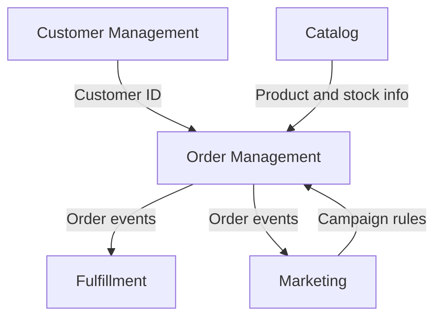

import { Callout } from 'nextra/components'

# Bounded Contexts

The active `backend` codebase uses five bounded contexts with clear ownership and integration points.

## Context Map

## Catalog Context

**Responsibility**: Product catalog management, inventory, and search.

**Key concepts**: `Product`, `Brand`, `Collection`, `Asset`, `ProductSKU`

## Order Management Context

**Responsibility**: Cart, checkout, order processing, and payment verification.

**Key concepts**: `Order`, `Cart`, `OrderLine`, `CartLine`, `Payment`, `Money`, `OrderCode`

## Customer Management Context

**Responsibility**: Customer identity, profiles, and address management.

**Key concepts**: `Customer`, `Address`, `Email`, `PhoneNumber`

## Fulfillment Context

**Responsibility**: Shipping methods, fulfillment flow, and delivery support.

**Key concepts**: `ShippingMethod`, `ShippingZone`, `ShippingCity`

## Marketing Context

**Responsibility**: Campaigns, discounts, banners, blog, and promotional content.

**Key concepts**: `Campaign`, `CampaignRedemption`, `Banner`, `BlogPost`

<Callout type="info">
  Cross-context communication uses domain events published to an in-process event bus so request handling stays loosely coupled.
</Callout>
